# Introduction

In this tutorial we will use the [BEAST2](http://www.beast2.org/) package
[BDMM-Prime](https://tgvaughan.github.io/BDMM-Prime) to perform a Bayesian
phylogenetic analysis of an influenza data set using the multi-type birth-death
model .

The multi-type birth-death model can be used to explain sequence data which have
evolved within a population that is clearly divided into separate compartments, demes, or types.
(We will use the terms deme, partition and type interchangeably here.)

The types can be geographical locations, as in our example, but the sequences can also be separated through other means than that, e.g. by a specific drug resistance mutation (strains can develop/lose drug resistance and thus move between types, but can not transfer between types otherwise), or location in the body (for example, for localised infections caused by the same agent).

In this tutorial you will learn how to apply this model to H3N2
sequences sampled from human hosts in two different geographical
locations.  These two locations will be our two types in the analysis.

The data set used in this tutorial is a thinned 60 sequence subset of the
980 sequence H3N2 influenza data set used in the publication , which in turn was
assembled from publicly-available data sets provided by various authors on
[GenBank](http://www.ncbi.nlm.nih.gov/genbank/).

(The BDMM-Prime package can be used for a wide range of single- and multi-type birth-death-skyline (BDSKY) model analyses, including birth-death population trajectory inference
.  See the full documentation at the [package website](https://tgvaughan.github.io/BDMM-Prime) for more details.)

## Software Requirements

### BEAST2 - Bayesian Evolutionary Analysis Sampling Trees

BEAST2 is a free software package for Bayesian evolutionary analysis of molecular sequences using MCMC and strictly oriented toward inference using rooted, time-measured phylogenetic trees. This tutorial is written for BEAST v{{ page.beastversion }} .


### BEAUti2 - Bayesian Evolutionary Analysis Utility

BEAUti2 is a graphical user interface tool for generating BEAST2 XML configuration files.

Both BEAST2 and BEAUti2 are Java programs, which means that the exact same code runs on all platforms. For us it simply means that the interface will be the same on all platforms. The screenshots used in this tutorial are taken on a Mac OS X computer; however, both programs will have the same layout and functionality on both Windows and Linux. BEAUti2 is provided as a part of the BEAST2 package so you do not need to install it separately.


### TreeAnnotator

TreeAnnotator is used to produce a summary tree from the posterior sample of trees using one of the available algorithms. It can also be used to summarise and visualise the posterior estimates of other tree parameters (e.g. node height).

TreeAnnotator is provided as a part of the BEAST2 package so you do not need to install it separately.


### Tracer

Tracer ([https://github.com/beast-dev/tracer/releases/](https://github.com/beast-dev/tracer/releases/)) is used to summarize the posterior estimates of the various parameters sampled by the Markov Chain. This program can be used for visual inspection and to assess convergence. It helps to quickly view median estimates and 95% highest posterior density intervals of the parameters, and calculates the effective sample sizes (ESS) of parameters. It can also be used to investigate potential parameter correlations. We will be using Tracer v{{ page.tracerversion }}.

### IcyTree

IcyTree ([https://icytree.org](https://icytree.org)) is a browser-based phylogenetic tree viewer. It is intended for rapid visualisation of phylogenetic tree files. It can also render phylogenetic networks provided in extended Newick format. IcyTree is compatible with current versions of Mozilla Firefox and Google Chrome.


## Installing the BDMM-Prime package

You can install the `BDMM-Prime` package via BEAUti's package manager.  To do this, follow these steps:

> Start BEAUti;
>
> In the application menu, **File** > **Manage Packages**.
>
> Find **BDMM-Prime** in the list of packages shown, select it and then click **Install/Upgrade**.

The BEAUTi window should look similar to what is shown below.
Note the actual version of `BDMM-Prime` may differ from the version shown in the figure, which is perfectly normal.

<figure>
	<a id="fig:install-bdmm-prime"></a>
	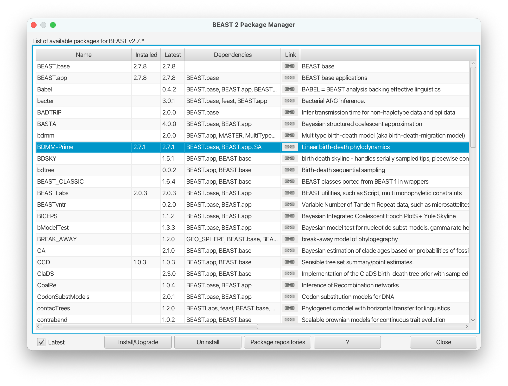
	<figcaption>Install `BDMM-Prime`.</figcaption>
</figure>
<br>

Finally, **restart BEAUti.**  The restart is necessary for the packages to be successfully installed.

If you get an error message stating that you are missing a package on which `BDMM-Prime` depends, install that package manually using the package manager as done above, and **restart BEAUti** again.

# Setting up the analysis using BEAUti

## Loading the data

We will first load in our example sequence data.  In our case, these data are stored in a FASTA file, the first few lines of which look like this (the sequences have been truncated for better readability):

```
> EU856841_HongKong_2005.34246575
-----------ATGAAGACTATCATTGCTTTGAGCTACATTCTATGTCTGGTTTTCGCTC...
> EU856989_HongKong_2002.58356164
-----------ATGAAGACTATCATTGCTTTGAGCTACATTCTATGTCTGGTTTTCGCTC...
> CY039495_HongKong_2004.5890411
-----------ATGAAGACTATCATTGCTTTGAGCTACATTCTATGTCTGGTTTTCGCTC...
> EU856853_HongKong_2001.17808219
-----------ATGAAGACTATCATTGCTTTGAGCTACATTTTATGTCTGGTTTTCGCTC...
> EU857026_HongKong_2003.51232877
-----------ATGAAGGCTATCATTGCTTTGAGCTACATTCTATGTCTGGTTTTCGCTC...
```

The lines beginning with ">" are labels for the sequences immediately
following.  In general, these labels have no special format, but in this file
each label is an underscore-delimited triple.  The first element of each triple
is the GenBank accession number of the sequence, the second is the geographical
region from which it was sampled, and the third is the time at which it was
sampled measured in calendar years or fractions thereof.

In this tutorial we will be using the influenza sequence data which can be found in the `examples` folder of the `BDMM-Prime` package.
To make it easier to find when loading the alignment, you can optionally set the working directory of BEAST2 to `BDMM-Prime`.
This will make BEAUTi open the appropriate package folder when you look for the alignment.
To set the working directory, select `File > Set working dir > BDMM-Prime`, as shown below.

<figure>
	<a id="fig:working-dir"></a>
	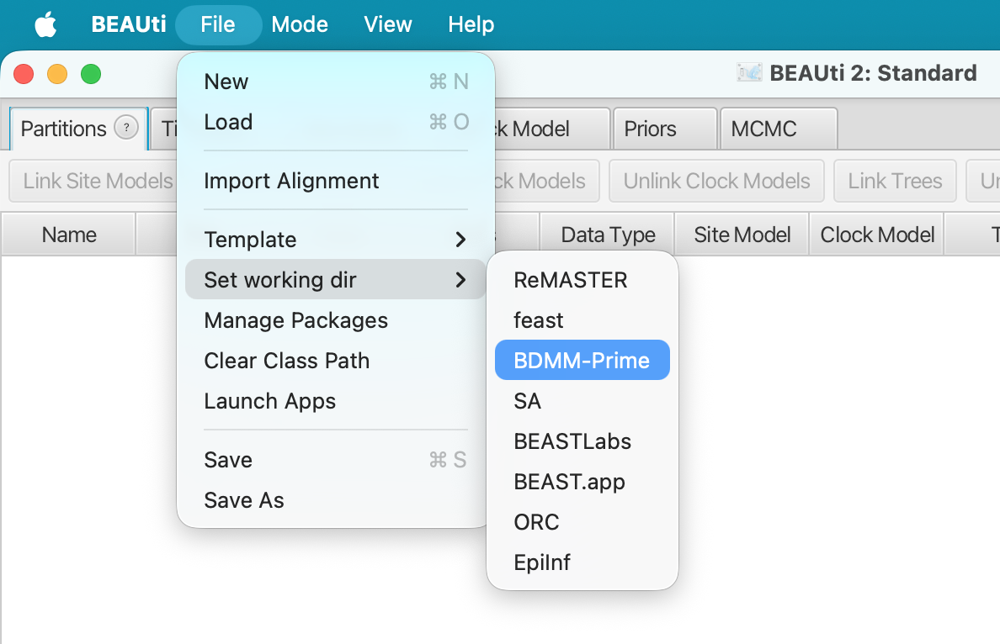
	<figcaption>Optional step: set the working directory to BDMM-Prime.</figcaption>
</figure>
<br>

To load the file, select `File > Add Alignment`.

This will open a file selection dialog box.  The example influenza sequence data
file is named `h3n2_2deme.fna`.
Assuming you have followed the previous step to set the working directory, this can be found in the `examples/` directory shown when the file selection dialog box appears.
In case you have not followed the previous step you will have to locate the folder containing the `BDMM-Prime` package and look for the `examples/` folder there.

Once the sequence file is loaded, your BEAUti screen should look similar to that shown below:

<figure>
	<a id="fig:alignment"></a>
	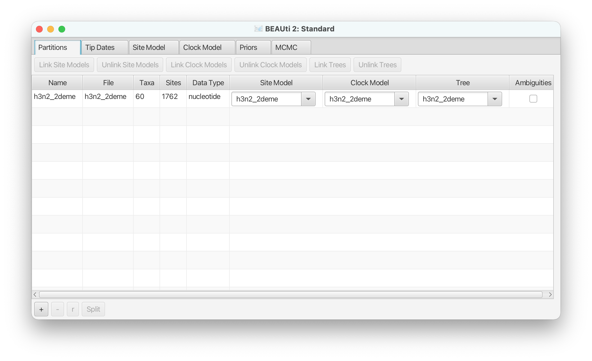
	<figcaption>The alignment loaded into BEAUti.</figcaption>
</figure>
<br>

## Setting up dates

Once the data is loaded, the next step is to specify the times at which the sequences were sampled:

> Select the **Tip Dates** panel.
>
> Check the **Use tip dates** checkbox.
>
> Click the **Auto-configure** button at the top-right of the panel.
> This opens a dialog that allows sample times to be loaded from a file or inferred (guessed) from the sequence labels.
>
> Because the times are included as the last element of the underscore-delimited sequence names, choose the **use everything** radio button and select **after last** from the drop-down menu. The default delimiter is already the underscore, so there is no need to change that.

The date parsing setup will look as shown in below.

<figure>
	<a id="fig:tip-dates"></a>
	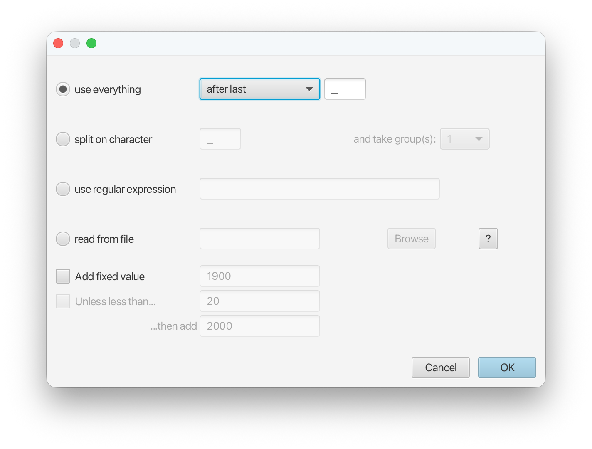
	<figcaption>Assigning the tip dates.</figcaption>
</figure>
<br>

After clicking `OK` you should find that the tip date table is filled with
times that match those in the sequence headers, and that the last column of the
table contains heights, i.e. times before most recent sample, calculated from the times.
The BEAUTi panel should look as shown below.

<figure>
	<a id="fig:tip-dates-set"></a>
	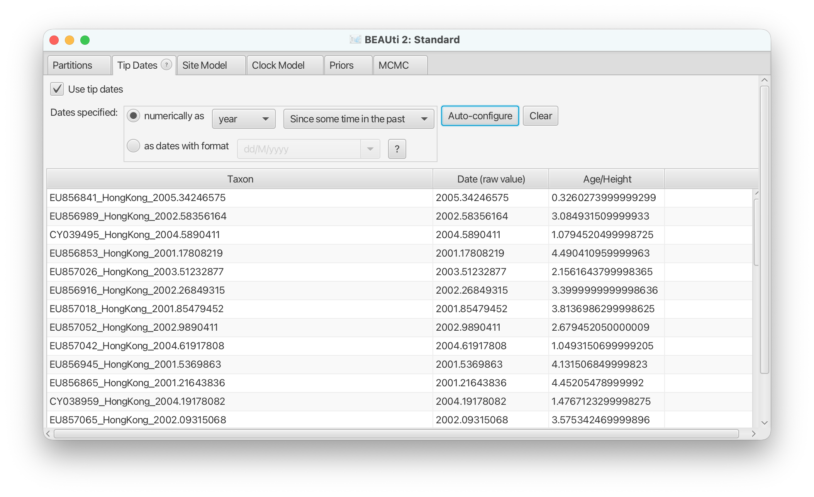
	<figcaption>Sampling dates as seen in BEAUti.</figcaption>
</figure>
<br>


## Setting the substitution model

For this analysis, we will use the HKY substitution model, with Gamma-distributed site to site rate heterogeneity to account for variations in substitution rate across the genome.
To approximate the continuous gamma rate distribution BEAST2 uses the discrete gamma distribution, where sites are divided into k equally probable rate categories.
In general, 4-6 categories work well for most datasets, while having more categories involve a lot of computation at little precision gain, so we set the `Gamma Category Count` to 4.
We would also like to estimate the `Shape` parameter, which describes the shape of the continuous gamma distribution we approximate.

The HKY substitution model is parameterized by a set of equlibrium base frequences and
the transition/transversion rate ratio, $\kappa$.  It is usually safe to estimate $\kappa$
as the sequence data usually contain relatively strong signal for the value.  It is also
common to estimate the equilibrium frequencies, although here we will fix them to their
empirical values (averages computed directly from the sequence alignment) to speed things
up slightly for this tutorial analysis.

>
> Switch to the **Site Model** panel.
>
> Set up the **Gamma Category Count** to 4.
>
> Leave the **Shape** parameter initialised to 1.0, with its **estimate** box checked.
>
> Select **HKY** from the Subst Model drop-down menu.
>
> Set **Frequencies** to **Empirical**.
>

The BEAUti panel should now look as shown below:

<figure>
	<a id="fig:site-model"></a>
	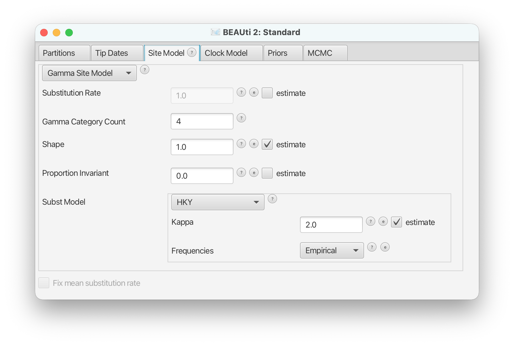
	<figcaption>Setup of the site model.</figcaption>
</figure>
<br>

Note that the `Substitution rate` defined on this panel should not be estimated - we use the `Clock rate` defined in the `Clock Model` panel to
determine the average per unit time rate of sequence evolution.
This way, the `Substitution rate` is not actually a rate, but rather a rate multiplier that we fix to 1 to allow parameter identifiability.

## Setting the clock model

To speed up the analysis we will assume a strict clock for this small
dataset.  However, the selection of a clock model for a different,
real analysis should not be taken lightly.  Since our alignment
contains sequences sampled at different times and those times are
measured in years, we must use a clock rate expressed in units of
expected substitutions per site per year.  Usually the precise value
is unknown and so the default behaviour of BEAUti is to assume this
rate has to be estimated.

We won't change this default setup here, but to speed up mixing we will
choose starting value for the clock rate inference which we know from
other research to be much closer to the true substitution rate than
the default value.

> 
> Switch to the **Clock Model** panel.
>
> Set the starting value of the `Clock rate` to 0.005. (Implicit units are substitutions per
> site per year.)
> 
The `Clock Model` panel should now look as shown below.

<figure>
	<a id="fig:strict-clock"></a>
	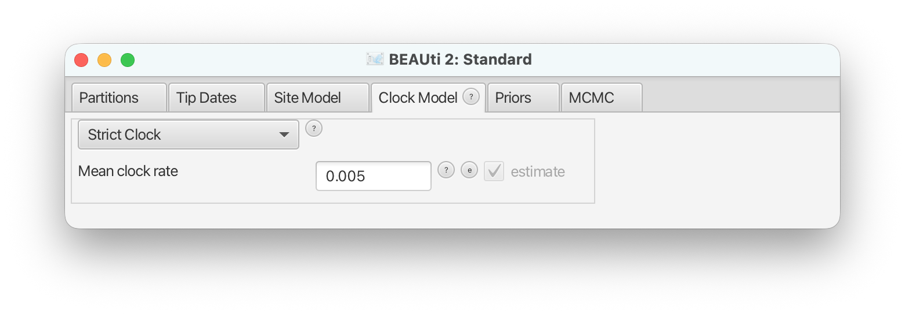
	<figcaption>Fix the clock rate to speed up mixing.</figcaption>
</figure>
<br>

## Adjusting priors

### Selecting the tree prior.

The primary functionality that `BDMM-Prime` provides is a prior probability distribution
over phylogenetic trees under a multi-type birth-death-sampling model.  Here we configure
the particular birth-death model we will use to relate the tree to the various population-level
parameters we'd like to learn about.

>
> Select the **Priors** panel.
>
> To choose the BDMM-Prime tree prior, find the drop-down menu next to Tree.t:h3n2_2deme
> and select **BDMMPrime**.
>

### Defining the tip types

The next thing we want to do is to specify the locations associated with each of the
samples included in our analysis.

>
> Expand the BDMM-Prime tree prior by clicking the arrow to the left of Tree.t:h3n2_2deme.
>
> Scroll down to end of the tree prior section and find the table associating tree leaves
> with locations. Notice that the sample names have the form ID_Location_Date.
>
> To extract the locations from the sample names, click the **Auto-configure** button,
> select **split on character**, ensure "_" is specified as the delimiter, and select
> "2" from the **take group(s)** drop-down menu.  Once this is complete, press "Ok".
>

<figure>
	<a id="fig:tip-types"></a>
	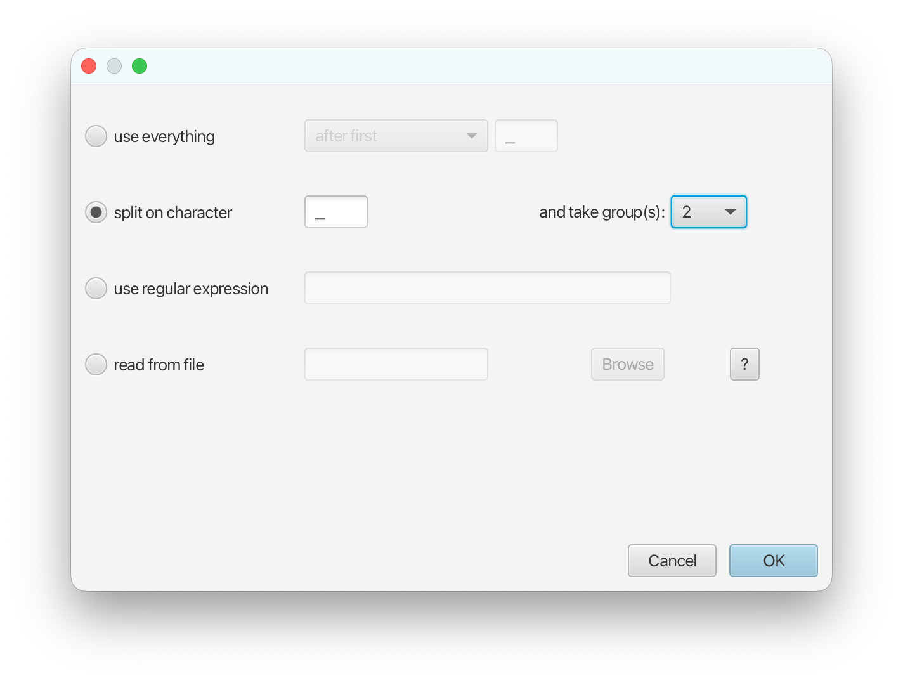
	<figcaption>Setting the tip types using Auto-configure.</figcaption>
</figure>
<br>


The table should now be populated with types extracted from the sample names.

<figure>
	<a id="fig:tip-types-set"></a>
	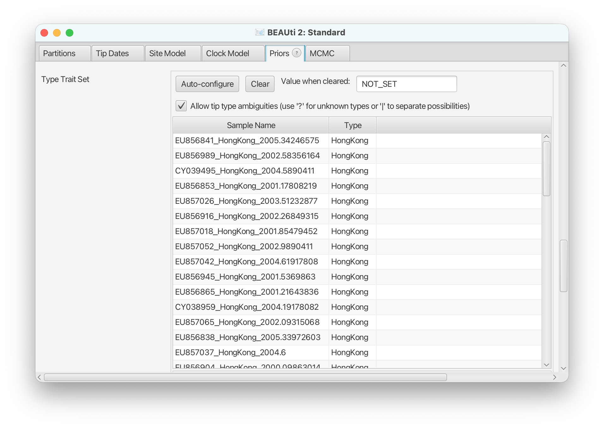
	<figcaption>Setting the tip types.</figcaption>
</figure>
<br>


### Configuring the multi-type model

Now we get to the main part of the analysis setup, where we decide exactly how
to model the generation of our data. In our case, we want to model a small part
of the global transmission dynamics of H3N2.

The first thing to do is to is to select our desired parameterization
of the birth-death model. In our case, as we're analysing pathogen
sequences in an attempt to reconstruct transmission dynamics, we'll
use the epidemiological parameterization.

>
> Scroll to the top of the tree prior and select **Epi Parameterization** from the
> drop-down menu at the top of the expanded section.
> 

<figure>
	<a id="fig:parameterization"></a>
	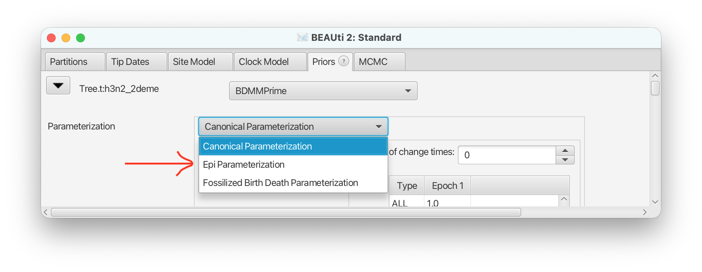
	<figcaption>Setting the parameterization types.</figcaption>
</figure>
<br>

With this done, the next task is to define the dimensionality and
initial values of the multi-type birth-death parameters. In BDMM-Prime,
each of these parameters is considered a "skyline parameter" which can
change in a piecewise-constant fashion through time.

The first skyline parameter to consider is the Re parameter, representing
the effective reproductive number.  By default parameter values are
assumed to be the same across all types, however we want to allow the
reproductive number to take location-specific values.

> 
> For the Re skyline parameter, uncheck the **Scalar values** check box to
> allow this parameter to take type-dependent values.
>

<figure>
	<a id="fig:Re"></a>
	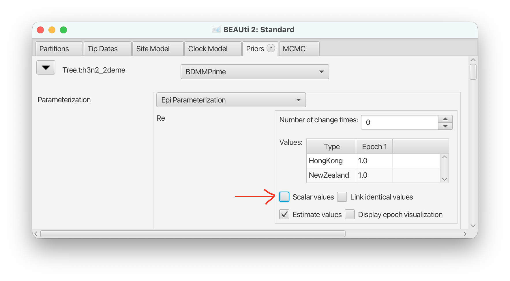
	<figcaption>Allowing type-specific Re values.</figcaption>
</figure>
<br>


The next parameter is the "become uninfectious rate" parameter,
representing the rate at which infected individuals become
uninfectious. This parameter includes the rate at which individuals
recovering on their own, together with the rate at which they are
removed from the population due to the sampling process.  Since it is
dictated by disease progression, this parameter is sometimes assumed
to be a function of the pathogen itself rather than location.  That
said, there are many reasons that it may be location-dependent in
reality. (Can you think of any?)

In any case, for the sake of this tutorial we will assume here that it
takes a single value which is shared among types. Furthermore, as
influenza infections often take a relatively short time to pass, we
will initialise this value to correspond to an infectious period of 1
week.

> 
> Find the **Become Uninfectious Rate** parameter, double-click the starting value and
> change it to 52 (per year).  **Be sure to press "Enter" to cause BEAUti to accept
> the new value.**
> 

<figure>
	<a id="fig:buRate"></a>
	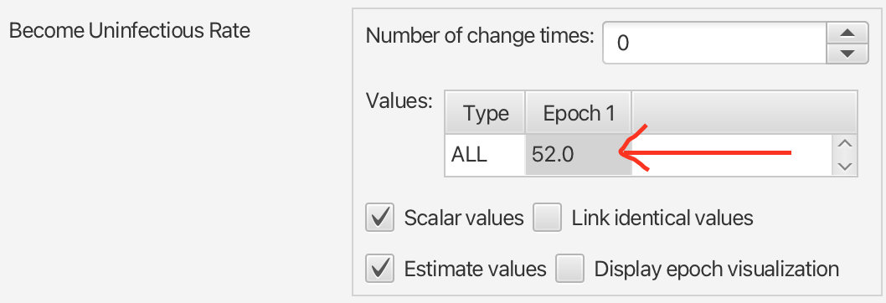
	<figcaption>Setting the starting value of the shared "become uninfectious rate".</figcaption>
</figure>
<br>

Now let's consider the Sampling Proportion parameter. This parameter requires
special care, as the sampling assumptions of the model can dramatically influence
inference results.  In our case we want (a) to allow for type-dependent sampling proportions
and (b) to fix the sampling proportion to zero for all times earlier than the first
sample. Allowing for type-dependent sampling proportions prevents us from having to
assume that the number of samples we have in each location are proportional to the
infected population in each of these individuals.  On the other hand, setting the
sampling proportion to zero prevents the model from interpreting the lack of samples
prior to a specific date as evidence for the absence of infected hosts in these earlier
times.

In BDMM-Prime, this configuration is reasonably simple to configure.
> 
> Find the Sampling Proportion parameter, then follow these steps:
> 1. Uncheck the **Scalar value** checkbox to allow for type-dependent values.
> 2. Check **Display visualization** to see the distribution of sample times relative
>    to the most recent sample.
> 3. Set the **Number of change times** value to 1.  (Notice the appearance of the epoch
>    boundary marker on the visualisation.)
> 4. Set the change time for the boundary between epoch 1 and 2 to 5.6. (Notice that this
>    value ensures the oldest sample remains in epoch 1.)
> 5. In the **Values** table, double-click the entries corresponding to
>    the sampling proportion values for Epoch 2 and change each to 0.0,
>    **remembering to press "enter" after each change.**
> 

Note **skyline parameter values of 0 are always fixed in the analysis**, regardless of
whether or not the "estimate values" option is checked.

<figure>
	<a id="fig:sampSetup"></a>
	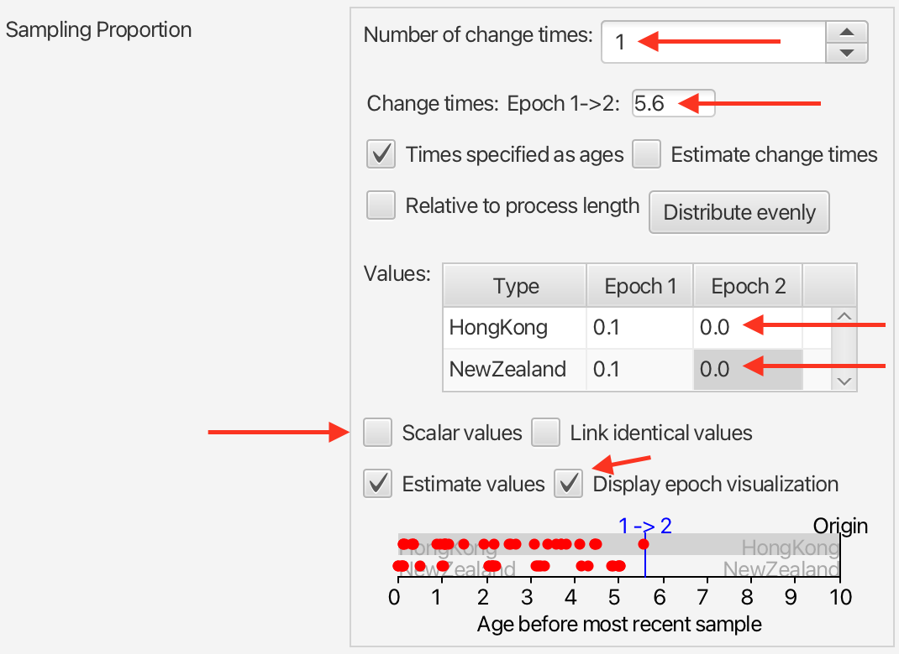
	<figcaption>Configuring the sampling proportion parameter.</figcaption>
</figure>
<br>

Finally, we need to define how lineages change type in our multi-type
model.  Like BDMM, BDMM-Prime allows both direct "migration" as well
as "birth to a new type" styles of multi-type models.  Given we are
modelling the movement of infected influenza hosts, migration suits
our situation best.  We also acknowledge that migration rates between
different pairs of types/locations may be different from one another.

To incorporate these decisions, follow these instructions:
> 
> Find the **Migration Rate** parameter, then:
> 1. Double-click on the **Value** and change it from it's default to the smaller
>    rate of 0.1 (any infected individual has a roughly 10% chance of moving between
>    the two locations in any given year).
> 2. Uncheck the **Scalar values** checkbox to allow rates to vary between pairs of
>    locations.
> 3. Check the **Estimate values** checkbox to ensure these migration
>    rates are estimated.
>
<figure>
	<a id="fig:migRate"></a>
	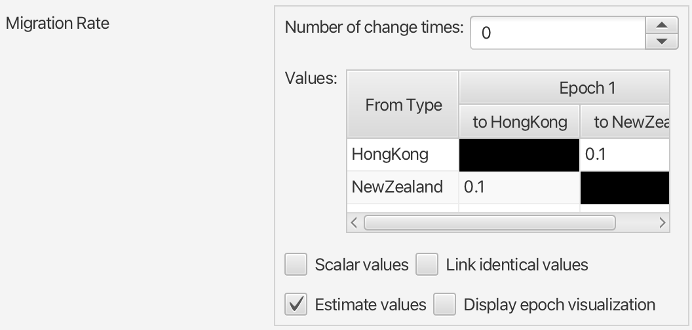
	<figcaption>Configuring the migration rate parameter.</figcaption>
</figure>
<br>


### Setting up other priors

BEAST2 provides a default prior distribution for each of the
parameters of your model which you've chosen to estimate.  These
priors are often very broad, and are "improper" - so broad that the
area under the distribution cannot be computed.  Thus it is important
to go through the parameters and set priors according to the
information we have about our dataset.

The first important parameter is the effective reproductive number, Re. In epidemiology, the reproductive number of an epidemic is the number of secondary cases one case generates on average over the course of its infectious period.  (A more fundamental quantity, the basic reproductive number R0, is the same but applied to a naive host population.) Values greater than 1 indicate expansion of the infected host population, while smaller values indicate contraction.

In practice, Re values tend to be within an order of magnitude of 1.0.  Thus we will apply
a Log Normal prior distribution to this parameter, centred on 1.0.

> 
> Collapse the tree prior by again clicking the arrow head to the left of Tree.t:h3n2_2deme.
>
> Expand the Re prior by clicking the arrow head to the left of ReEpi.t:h3n2_2deme.
>
> Select **LogNormal** from the drop-down list of distributions.
>
> Set the **M** value to 0.0 and the **S** value to 0.5.
>

<figure>
	<a id="fig:R0-prior"></a>
	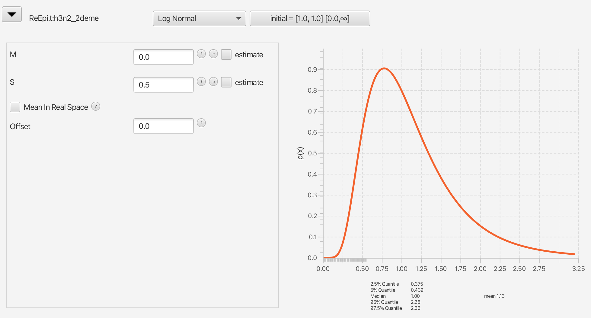
	<figcaption>Set the prior for the Re.</figcaption>
</figure>
<br>

Next, we consider the prior on the "become uninfectious rate". As mentioned above, this rate describes how quickly individual infected individuals become uninfectious *to the rest of the population*, be that through recovery, quarantine, or some other process.

We know that for influenza an average infection lasts around a week.
What rate value does this correspond to?  To determine this, consider
that our rates describe the probability per unit time that the
corresponding event happens on a single lineage. The time unit in this
case is "year", since our tip dates were specified in fractional
years.  Thus the become uninfectious rate value specifies the
probability per year (calculated instantaneously) that an individual
becomes uninfectious. An average infectious interval of one week (1/52 years)
corresponds to an average become uninfectious rate of 1/(1/52)=52 in units
of inverse years.

For our analyisis we will therefor place a Log Normal prior on the become
uninfectious parameter with a mean of 52 and an S parameter to allow for
some variation around this mean.

> 
> Expand the become uninfectious prior by clicking the arrow to the left of
> becomeUninfectiousRateEpi.t:h3n2_2deme.
>
> Select **Log Normal** from the drop-down list of distributions.
>
> Set the **M** value to 52.0 and the **S** value to 0.5.
>
> Ensure the **Mean in Real Space** checkbox is checked.
>

<figure>
	<a id="fig:buRatePrior"></a>
	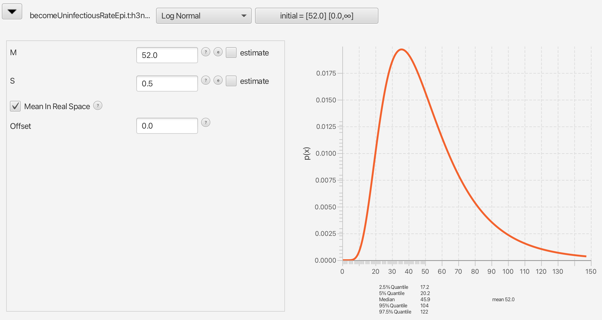
	<figcaption>Set the prior for the become uninfectious rate.</figcaption>
</figure>
<br>


We now consider the sampling proportion prior. We will set this prior
to a narrow distribution peaked around the very low values, as
influenza spreads easily, but only few people actually get sampled.
Taking into account that we are also using a thinned-down version of
the dataset, we can use a diffuse prior with the mean around
10<sup>-3</sup>.
Again we will use a truncated `Log Normal` prior, with the mean at 10<sup>-3</sup>.

>
> Expand the sampling proportion prior by clicking the arrow to the left of
> samplingProportionEpi.t:h3n2_2deme.
>
> Select **Log Normal** from the drop-down list of distributions.
>
> Set the **M** value to 0.001 and the **S** value to 0.5.
>
> Ensure the **Mean in Real Space** checkbox is checked.
>

Note that this prior will be automatically truncated to the unit interval [0,1],
and will be applied only to the non-zero sampling proportions.

<figure>
	<a id="fig:sampPropPrior"></a>
	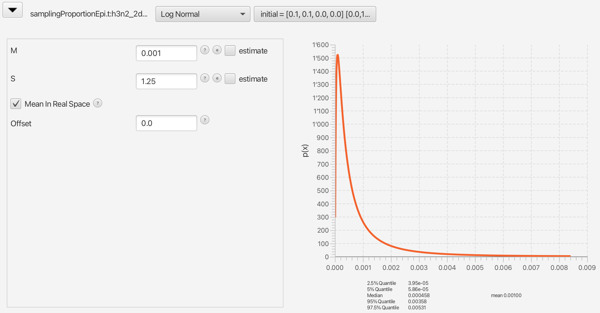
	<figcaption>Set the prior for sampling proportion.</figcaption>
</figure>
<br>


In setting the migration rate prior, consider that the migration rate governs the speed of
movement of infected individuals between the locations in question: Hong Kong and New Zealand.
For the purpose of the tutorial, we will assume that a given infected individual has only a
10% chance of visiting the other country in any given year.

>
> Expand the migration rate prior by clicking the arrow to the left of
> migrationRateEpi.t:h3n2_2deme
>
> Select **Exponential** from the drop-down list of distributions.
>
> Set the **mean** value to 0.1.
>

Our use of an Exponential distribution rather than a Log Normal distribution here
is a practical consideration to improve mixing of this tutorial analysis.  In a
real analysis one should think carefully about how 

<figure>
	<a id="fig:mig-rate-prior"></a>
	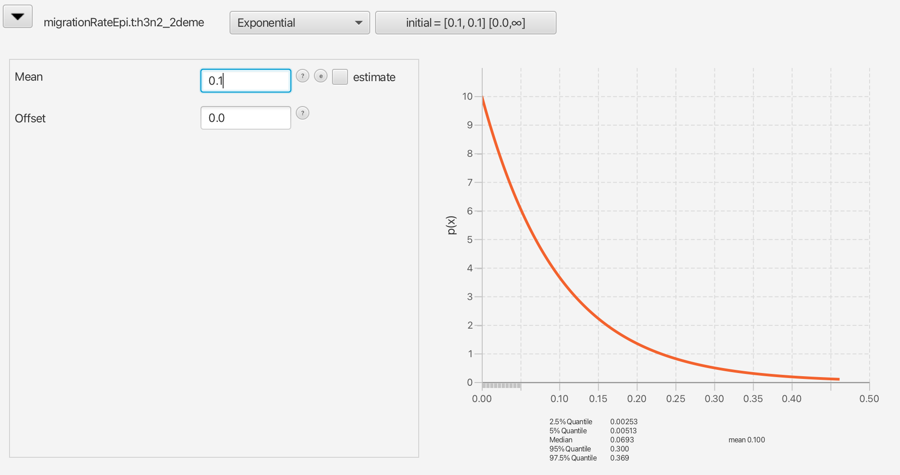
	<figcaption>Set the prior for the migration rate.</figcaption>
</figure>
<br>


We will also set the prior for the clock rate to a distribution that is in accordance with what we know about RNA viruses, which is that in general their mean substitution rate is around  10^(-3).

>
> Expand the clock rate prior by clicking the arrow to the left of clockRate.c:h3n2_2deme
>
> Select **Log Normal** from the drop-down list of distributions.
>
> Set the **M** value to 0.005 and the **S** value to 0.5.
>
> Make sure to check the **Mean in Real Space** checkbox.
>

<figure>
	<a id="fig:clock-rate-prior"></a>
	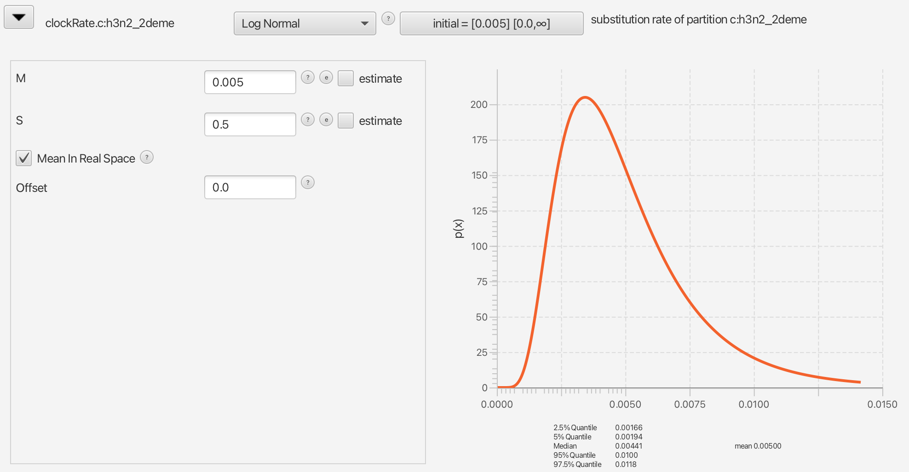
	<figcaption>Set the prior for the clock rate.</figcaption>
</figure>
<br>

## Saving the configuration

We will leave the `MCMC` panel settings to their default values.

>
> Save the configuration file as h3n2-bdmmprime.xml.  (Be sure to note
> where you have saved it!)
>

# Running the analysis using BEAST

To run the analysis, simply start BEAST 2 in the manner appropriate
for your platform, then select the configuration file you generated in
the last section as the input.

Note that this particular analysis can take quite some time to run to
completion.  (On a MacBook Pro with 3.1 GHz Intel Core i5 processor it
takes about 3 hours for 10'000'000 samples.)  Try to run it and
observe the results, but for the purpose of finishing the tutorial in
a reasonable time, check out the provided log file to see the results.

# Analyzing the results

The results of the analysis primarily consist of two parts:

1. The parameter log, which is written to the file `h3n2-bdmmprime.log`.
2. The multi-type tree log, which is written to `h3n2-bdmmprime.h3n2_2deme.typed.trees`.

The additional file `h3n2-bdmmprime.h3n2_2deme.typed.node.trees` is the
TreeAnnotator-compatible file we'll use to assemble a summary tree.
(The `h3n2-bdmmprime.h3n2_2deme.trees` file is a tree log containing the
trees without any type information.  It is safe to ignore this for now.)

## Parameter log file analysis

We can use the program [Tracer](https://github.com/beast-dev/tracer/releases/) to view the parameter log file.
To do this, start Tracer and then press the `+` button in the top-left hand corner of the window (under `Trace File`).
Select the log file for this analysis (`h3n2-bdmmprime.log`) from the file selection dialog box.
You can also simply drag your log file from the file browser to the Tracer window.
The `Traces` table will then be populated with parameters and summary
statistics corresponding to our multitype birth-death analysis.

Important traces are:

* `ReSPEpi.HongKong` and `ReSPEpi.NewZealand`: These give the effective reproduction numbers Hong Kong and New Zealand, respectively.

* `becomeUninfectiousRateSPEpi`: This is the overall become uninfectious rate.

* `migrationRateSPEpi.HongKong_to_NewZealand` and `migrationRateSPEpi.NewZealand_to_HongKong`: These give the (per lineage per year) migration rates from Hong Kong to New Zealand and vice versa.

* `typeMappedTree.count_HongKong_to_NewZealand` and `typeMappedTree.count_NewZealand_to_HongKong` : this gives the number of ancestral migrations from Hong Kong to New Zealand and vice versa on the inferred tree.

The tabs at the top-right of the window can be used to display one or more selected traces in various ways.
We can look at the become uninfectious rate by selecting the `becomeUninfectiousRate.t:h3n2_2deme.1` trace (see [Figure 16](#fig:tracer-bUR)).
The 95% HPD for the parameter is quite wide ([18.699, 88.5431]), which is most likely due to the fact that we have very little data, however the mean value is 49.3247, which gives us an infectious period of 7.4 days.
Next, selecting the two R<sub>0</sub> traces (`R0.t:h3n2_2deme.1` and `R0.t:h3n2_2deme.2`) and choosing the `Marginal Density` panel results in useful comparison between the sampled population size marginal posterior distributions (see [Figure 17](#fig:tracer-R0)).
Looking at the posterior distributions we can not see any significant difference in R<sub>0</sub> between the two demes.
While the distributions are visibly different, they cover the same parameter range (deme 1 95% HPD interval [0.9922, 1.0258], deme 2 95% HPD interval [0.9057, 1.038]), so the values are indistinguishable through such analysis.

<figure>
	<a id="fig:tracer-bUR"></a>
	
	<figcaption>Estimated become uninfectious rate marginal posterior.</figcaption>
</figure>
<br>

<figure>
	<a id="fig:tracer-R0"></a>
	
	<figcaption>Estimated R<sub>0</sub> marginal posteriors.</figcaption>
</figure>
<br>

In the case of our pre-cooked analysis all the ESS values are greater than 200 – the arbitrary threshold for acceptability.
However, it might happen that some values have not yet reached the appropriate ESS in the runs that you did on your own.
If this analysis were part of a serious study you would want to run the chain for another few million iterations to improve the ESS values.
In BEAST 2, analyses can be resumed – the samples you already have will not be wasted.

## Tree log visualization

The popular phylogenetic tree visualizer [FigTree](http://tree.bio.ed.ac.uk/software/figtree/) can be used to visualize the sampled trees.
However, Figtree can be quite slow with MultiTypeTree log files, so for this tutorial we suggest using [IcyTree](https://icytree.org/) to view tree log files.
IcyTree is a tree viewer that runs in a web browser, which runs best under recent versions of [Google Chrome](http://www.google.com/chrome) and [Mozilla Firefox](https://www.mozilla.org/en-US/firefox/) (in that order).

To view MultiTypeTree log files using IcyTree, simply navigate to the IcyTree web page, select `Load from file` from the `File` menu, then select the `h3n2-bdmmprime.h3n2_2deme.trees` tree log file using the file selection dialog.
Alternatively, you can simply drag the log file into your browser window.
Once the file is loaded you will see the first tree it contains.
In order to select a different tree, hover the mouse pointer over the box in the lower-left corner of the window.
This box will expand to a small dialog containing buttons allowing you to navigate between trees.
The `<` and `>` buttons move in steps of 1 tree, while `<<` and `>>` move 10% of the tree file.
You can also directly enter the index of a tree.

Initially the tree edges will be uncoloured.
To colour the edges according to the edge type (this is the strain location in our case), navigate to `Style > Colour edges by` and select `type`.
A legend and axis can be added by choosing `Display legend` and `Axis > Age` from the same menu.
You can browse the trees from your posterior sample (as in the figure below) to look at the traits they share, however in general we need some sort of a summary to be able to draw conclusions from our tree sample.

<figure>
	<a id="fig:icyTree-trees"></a>
	
	<figcaption>An example of a sampled multi-type tree in IcyTree.</figcaption>
</figure>
<br>


## Producing a summary tree using `TreeAnnotator`

We can make better use of our raw analysis results by using the
`TreeAnnotator` program which is distributed with BEAST2 to analyze
the sample of trees which was produced by our MCMC run. Until recently
the _maximum clade credibility_ tree (MCC) has been the default
summary method in TreeAnotator.

To produce MCC trees, TreeAnotator takes the set of trees and find the
best supported tree by maximising the product of the posterior clade
probabilities. It will then annotate this representative summary tree
with the mean ages of all the nodes and the corresponding 95% HPD
ranges as well as the posterior clade probability for each node.

Another point estimate, called a _conditional clade distribution_ tree (CCD)
has been proposed .
This has been shown to outperform MCC in terms of accuracy (based on
Robinson-Foulds distance to the true tree) and precision (how
different are the point estimates calculated for replicate MCMC
chains). CCD methods may produce a tree that would be well supported
but has not been sampled during MCMC. This is beneficial for large
trees and complex parameter regimes. Since both methods are still
widely used, we show how to use them to summarise the posterior tree
distribution.

**To save time, you may run just one method and compare it to the other using the example below.**

### Producing an MCC summary tree

> Start **TreeAnnotator**
> 
> Set the **Burnin percentage** to **10%** to discard the first 10% of trees in the log file.
> 
> Set the **Target tree type** to the **Maximum clade credibility tree** and set **Node heights** to **Mean heights**.
> 
> Select the `h3n2-bdmmprime.h3n2_2deme.typed.node.trees` tree file as the input file and `h3n2-bdmmprime.h3n2_2deme.mcc_summary.trees` as the output file
> 
> Pressing the **Run** button will produce an annotated summary tree.

The setup can be seen in the figure below.

<figure>
	<a id="fig:TreeAnnotator-setup"></a>
	
	<figcaption>Use TreeAnnotator to produce a MCC summary tree.</figcaption>
</figure>
<br>

### Producing CCD0 summary tree

To produce CCD0 summary tree, you will first need to install the CCD package.
> Open BEAUTi
> 
> Select **File** >> **Manage packages**
> 
> Select **CCD** package in the list and select **Install/Upgrade**
> 
> Close BEAUTi

<figure>
	<a id="fig:installCCD"></a>
	
	<figcaption>Install CCD package</figcaption>
</figure>
<br>

Now you can proceed to make CCD0 tree. Use the exactly same set up as for MCC tree but select **MAP (CCD0)** as **Target tree type** and `h3n2-bdmmprime.h3n2_2deme.ccd0_summary.trees` as the output file.


## Visualising the summary tree

To visualize this tree, open IcyTree once more (maybe open it in a new browser tab), choose `File > Load from file`, then use file selection dialog and select either select either `h3n2-bdmmprime.h3n2_2deme.mcc_summary.trees` or `h3n2-bdmmprime.h3n2_2deme.ccd0_summary.trees` to load MCC or CCD0 summary tree respectivelly.
Follow the instructions provided above to colour the tree by the `type` attribute and add the legend and time axis.
In addition, open the `Style` menu and select `Node height error bars > height_95%_HPD` to add error bars to the internal node heights.
Finally, open the `Style` menu and select `Relative edge width > type.prob`.
This makes the edges become increasingly thinner as the posterior probability for the displayed branch decreases.

Once these style preferences have been set, you should see something similar to the MCC or CCD0 trees shown in the figures below.

<figure>
	<a id="fig:icyTree-mcc"></a>
	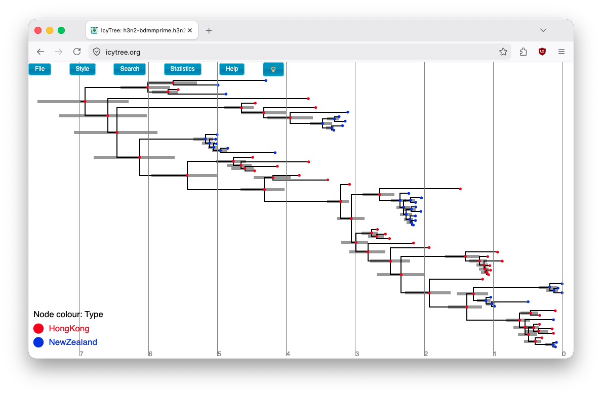
	<figcaption>The MCC summary tree in IcyTree.</figcaption>
</figure>
<br>

<figure>
	<a id="fig:icyTree-ccd0"></a>
	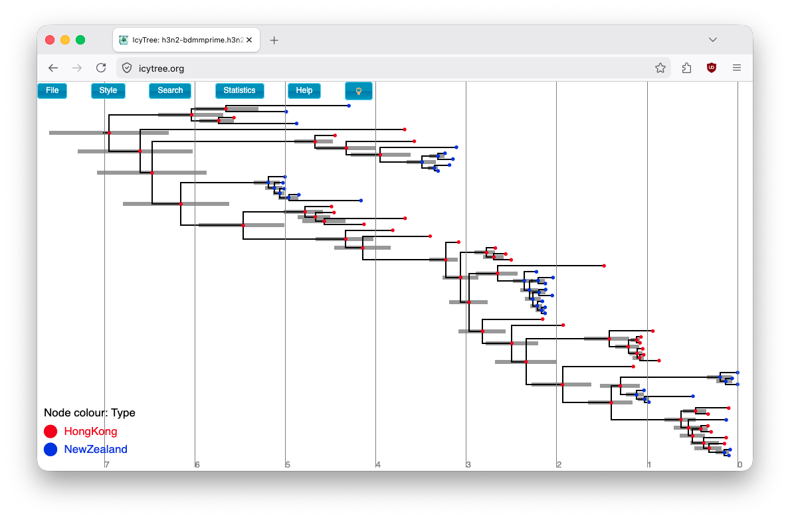
	<figcaption>The CCD0 summary tree in IcyTree.</figcaption>
</figure>
<br>

Here we have a full consensus tree annotated by the locations at coalescence nodes and showing node height uncertainty, with the width of the edges representing how certain we can be of the location estimate at each point on the tree.
This is a much more comprehensive summary of the phylogenetic side of our analysis.
One thing to pay attention to here is that the most probable root location in the summary tree is Hong Kong (under our model which assumes that only Hong Kong and New Zealand exist).
Hovering the mouse cursor over the tiny edge above the root will bring up a table in which posterior probability of the displayed root location (`type.prob`) can be seen.
In this analysis we see that it is about 91%.
The analysis therefore strongly supports a Hong Kong origin over a New Zealand origin for this flu sample.

### MCC and CCD0 summary tree comparison (Optional)

Now, compare the figures for MCC and CCD0 summary trees. Can you see some differences?

One of the CCD0 summary method advantages is that it can evaluate tree topologies that were not sampled during the MCMC. This is why it usually performs better on high-entropy (uncertain, spread out) tree posterior. Knowing this, what observations can you make about our sample?

----

# Acknowledgment

The content of this tutorial is based on the [Structured birth-death model tutorial](https://taming-the-beast.org/tutorials/Structured-birth-death-model/) by Denise Kühnert and Jūlija Pečerska.

# Useful Links

- Multi-type birth-death process package: https://tgvaughan.github.io/BDMM-Prime
- BEAST 2 website and documentation: http://www.beast2.org/
- BEAST 2 book: [Bayesian Evolutionary Analysis with BEAST 2](http://www.beast2.org/book.html) 

-----

# Relevant References


